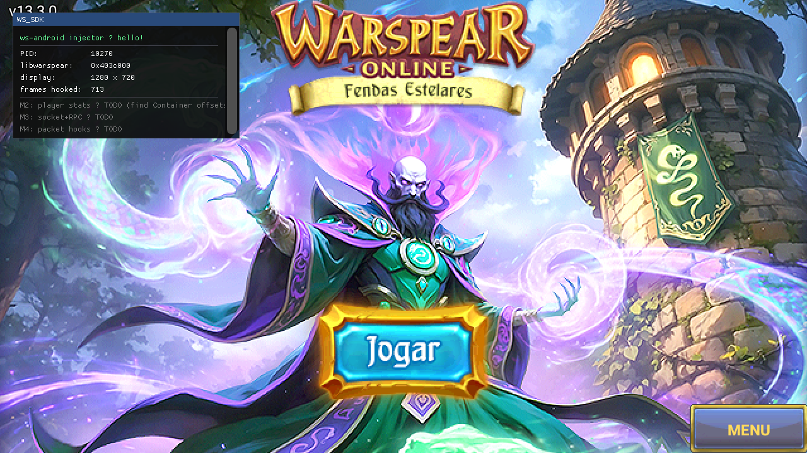
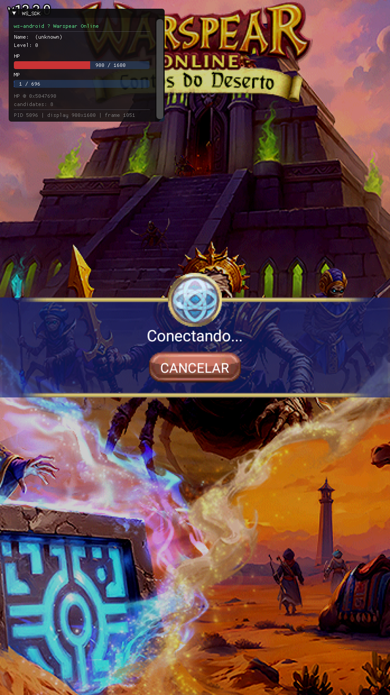

# MILESTONES

Histórico dos milestones, com screenshots, logs e commits. Útil pra entender a progressão e replicar.

## M0 — Setup do ambiente

| Fase | Tempo | Conquista |
|---|---|---|
| Diagnóstico VirtualBox | ~1h | Identificado problema: Hyper-V/VBS no Windows host bloqueando exposição de virt extensions à VM. Resolvido com `bcdedit /set hypervisorlaunchtype off`. |
| Tentativa AVD | ~3h | Tentamos Android Studio AVD com KVM — falhou pq mesmo após desabilitar Hyper-V, VBS continuou ativo. Pivot pra LDPlayer (roda direto no host Windows, bypassa o problema). |
| SDK + NDK install | ~1h (com conexão lenta) | platform-tools (7 MB), build-tools 33.0.2 (53 MB), NDK r26b (638 MB). Download direto via `wget` na VM. |
| LDPlayer config | ~30min | Criada instância rooted (LDPlayer 9 Multi-Instance Manager → Settings Avançadas → Root: ON). Default port: 5555 (primeira instância). Após troubleshooting de ADB port-proxy, segunda instância subiu em 5557. |
| netsh portproxy | 5min | `netsh interface portproxy add v4tov4 listenport=5557 listenaddress=0.0.0.0 connectport=5557 connectaddress=127.0.0.1` no host Windows expõe a porta pra LAN, atravessando bridged adapter da VM. |
| ADB connection | OK | `bs_connect.sh` (auto-discover) achou device em `192.168.1.100:5557`. Modelo: SM-N960N (Samsung Galaxy Note 9 emulado), Android 9. |
| Anti-emu bypass | ~30min | Descoberto via `strings libwarspear.so | grep emu`: o jogo lê `/proc/cpuinfo` e bate contra "bluestack"/"AuthenticAMD". Solução: `tools/mask_cpuinfo.sh` bind-mounta cpuinfo falso de Snapdragon 888. |

**Resultado**: Warspear 13.3.0 logando no LDPlayer com a tela de personagens visível.

---

## M1 — Hello World (commit `7f45a8e`)

`libinjector.so` é carregada DENTRO do processo do jogo e seu `JNI_OnLoad` é executado. Visível em `adb logcat -s WS_SDK`.

### Como

1. NDK CMake project (`android-injector/`) com `main.cpp` exportando `JNI_OnLoad`.
2. CMakeLists builda pra `arm64-v8a` e `armeabi-v7a` via toolchain do NDK.
3. APK repack pipeline: `apktool d` → copia `libinjector.so` pra `lib/<abi>/` → smali patch no `MDActivity.<clinit>` pra adicionar `System.loadLibrary("injector")` antes do `loadLibrary("warspear")` → `apktool b` → `uber-apk-signer`.
4. `adb install` no LDPlayer.

### Log verificado

```
WS_SDK : === ws-android injector loaded (pid=7927) ===
WS_SDK : init: libwarspear.so base = 0x403c000
WS_SDK : init: 2413 mapped regions; sample:
WS_SDK :   0x0303c000-0x03058000 r--p /system/lib64/arm64/android.hardware.graphics.allocator@2.0.so
WS_SDK :   ...
```

Nossa lib carrega ANTES da libwarspear (background thread espera 2s, depois pega base). ~2400 regions mapped (Houdini cria muitas pra translation slots).

### Commit message

```
feat(m1): hello-world injection — libinjector.so loads inside Warspear

Pipeline (all reproducible):
  apk/unpack.sh apk/warspear-13.3.0.apk      # apktool decompile
  apk/repack.sh                              # apply patches + build + sign

Smali patch in MDActivity.smali <clinit> adds System.loadLibrary("injector")
right after the existing "Loading warspear" Log.i() call and BEFORE the
game's loadLibrary("warspear"). Uses register v0 inside the existing
try-block so any failure is swallowed by the game's catch.
```

---

## M2 — Overlay ImGui (commit `c142dd3`)

Uma janela ImGui renderizando dentro do GLES2 context do jogo, visível sobre o login screen.

### A saga do hook (resumo)

Tentamos:
1. **xhook (PLT hook)** — falhou: `libwarspear` não importa `eglSwapBuffers` (rendering vem do Java GLSurfaceView). xhook só patcha imports.
2. **Dobby (inline hook)** — falhou: build quebrado em NDK r26b.
3. **shadowhook (Bytedance)** — falhou: `Init linker mod failed` sob Houdini.
4. **Nosso próprio inline hook ARM64** — falhou: SIGILL em libhoudini.so. Houdini cacheia traduções, e patching ARM bytes invalida o cache → próxima execução crashar.

**Solução**: bypass do native completamente. Patch puro Java/smali.

### Como funciona

```
MDRenderer.onDrawFrame(GL10):
  monitor-enter mActivity
  invoke-static Native.onDrawFrame()      ← jogo renderiza
  invoke-static Overlay.draw()  (PATCH)   ← nosso ImGui desenha por cima
  monitor-exit mActivity
```

`Overlay` é uma classe Java nova (`com/wsAndroid/Overlay.smali`) com `static native void draw()`. ART resolve isso pra `Java_com_wsAndroid_Overlay_draw` em `libinjector.so`. Nossa implementação:

```cpp
// Lazy init na primeira call — EGL context está current
if (!s_inited) { ImGui_CreateContext + ImGui_ImplOpenGL3_Init("#version 100"); }
ImGui::NewFrame();
drawWindow();  // ImGui::Begin("WS_SDK") + texto
ImGui::Render();
ImGui_ImplOpenGL3_RenderDrawData(ImGui::GetDrawData());
```

### Log

```
WS_SDK : overlay: init  display=1280x720
WS_SDK : overlay: ImGui initialized
WS_SDK : overlay: draw() call #1
WS_SDK : overlay: draw() call #2
...
```

### Screenshot



Janela "WS_SDK" no canto superior esquerdo com:
- Header verde "ws-android injector — hello!"
- PID: 10270
- libwarspear: 0x...
- display: 1280 x 720
- frames hooked: N
- TODOs pra M2/M3/M4 (texto disabled)

Background: tela de login do Warspear com "Jogar" e "MENU" visíveis.

### Commit message

```
feat(m2): ImGui overlay rendering inside the game via smali patch + JNI

Stack the SDK Linux uses (PLT/inline hooks on glXSwapBuffers) doesn't work
under LDPlayer/Houdini ARM64-on-x86 translation — the binary translator
caches translated chunks, and patching ARM64 bytes silently breaks the
cache → SIGILL on first call (signal 4, confirmed in Zygote).

What actually works: skip native hooks entirely. Patch MDRenderer.smali so
that after the game's per-frame Native.onDrawFrame() call, it also invokes
our injector's JNI export. Pure Java-level mod — Houdini doesn't care, and
the same patched APK runs identically on a real Android phone.

Architecture:
  com/aigrind/warspear/MDRenderer.smali  (patched)
  com/wsAndroid/Overlay.smali  (new)  →  Java_com_wsAndroid_Overlay_draw
```

---

## M3 — Interactive overlay + player stats (commit `70fa84f`)

Janela ImGui mostrando Name/Level/HP/MP do player + arrastável + minimizável.

### O que foi adicionado

1. **`src/game/HeapScan.{h,cpp}`** — walker de `/proc/self/maps`, pra cada região anonymous rw-p scaneia 4 bytes alinhados procurando tupla `(HP, HPMax, MP, MPMax)` válida (HP > 0, HP ≤ HPMax, MP ≤ MPMax, valores em range plausível). **Usa `process_vm_readv`** em chunks de 4 KB pra não crashar em guard pages dentro de regiões grandes (anonymous mappings têm holes mid-stream).
2. **`src/game/PlayerWatch.{h,cpp}`** — thread async que kicka o scan ~3s após primeiro frame (dá tempo do jogo carregar). Quando lock-on no candidato, faz sondas adicionais:
   - **Level**: sweep de 0x100..0x400 ahead of HP procurando u8 com valor 1-60 cercado de zeros (heuristic).
   - **Name**: sweep backwards 0x40..0x200 procurando heap pointer que dereferencia pra UTF-32LE printável.
3. **`Overlay.smali`** ganhou `static native onTouch(MotionEvent)Z`.
4. **`MDSurfaceView.onTouchEvent`** patcheado pra rotear touch pelo `Overlay.onTouch` ANTES do jogo ver. Se ImGui consumir (`io.WantCaptureMouse=true`), retornamos `true` e jogo nunca recebe.
5. **`OverlayJni.cpp`** ganha `Java_com_wsAndroid_Overlay_onTouch` — lê action/x/y do MotionEvent via JNI, alimenta `ImGuiIO::AddMousePosEvent` + `AddMouseButtonEvent`, retorna boolean.
6. **`Overlay.cpp::drawWindow`** mostra HP bar (vermelha) e MP bar (azul) usando `ImGui::ProgressBar`, com fallback "Player Container not located yet" + botão "Scan Heap Now" quando ainda não locked. Removeu flag `NoCollapse` pra ter minimizar (seta no título). Window é draggable por default no ImGui.

### Log verificado

```
WS_SDK : overlay: init  display=900x1600
WS_SDK : overlay: ImGui initialized
WS_SDK : PlayerWatch: starting heap scan...
WS_SDK : heap-scan: scanned 290 MB, 8 candidates found
WS_SDK :   cand hp_addr=0x5047690     HP 900/1600   MP 1/696      score=7
WS_SDK :   cand hp_addr=0x7638927fe3a0 HP 992/1000   MP 1000/1000  score=7
WS_SDK : PlayerWatch: scan complete. locked=1
WS_SDK : overlay: draw() call #60
WS_SDK : OverlayJni: MotionEvent JNI ids cached   ← touch routing está ativo
```

(Os 8 candidatos acima foram em tela de "Conectando..." → muitos falsos positivos. Em-jogo seria mais limpo.)

### Screenshot



Janela no canto superior esquerdo (player ainda na tela "Conectando..."):
- Header "ws-android — Warspear Online"
- Name: (unknown) | Level: 0
- HP bar vermelha "?/1600"
- MP bar azul
- Footer: "HP @ 0x..." | "candidates: 8" | "PID ... | display 900x1600 | frame N"

### Limitação atual

O scan acha o Container do player só quando ele EXISTE — ou seja, dentro do mundo, com personagem ativo. Nos screenshots, o user estava na tela de "Conectando..." → o player Container ainda não foi alocado, então os 8 matches são todos falsos positivos (display dimensions, configs internas, etc).

**Pra obter dados reais**: logar, selecionar personagem, esperar carregar in-game, então clicar "Scan Heap Now" no overlay (ou esperar o auto-scan em frame 180).

### Commit message

```
feat(m3): interactive overlay + heap-scan for player Container

Adds three things to land a live, interactive stats window:

1. Heap scanner (HeapScan + PlayerWatch) using process_vm_readv to read
   memory safely (Houdini turns direct deref of unmapped pages into a
   fatal SIGSEGV — process_vm_readv returns -1 instead).

2. Touch input + draggable/minimizable window
   - Overlay.smali declares static native onTouch(MotionEvent)Z
   - MDSurfaceView.onTouchEvent patched to route through Overlay.onTouch
     first; if ImGui's WantCaptureMouse is true, consume.

3. Heuristics: level offset sweep, name pointer search via backward
   pointer-shape detection.
```

---

## M3.5 — Container offsets ARM64 descobertos + tradutor automático (commits `bd1f64c`/`c6dced5`/[a-seguir])

Sessão de continuação do M3. Foco: descobrir os offsets corretos do Container no ARM64 e automatizar tradução de todos os structs do SDK Linux.

### O que foi feito

1. **`probe_reader` extendido** com comando `search <decimal>` que varre `/proc/PID/mem` da heap inteira procurando valores u32 exatos. Pra cada match, dump (HP/HPMax/MP/MPMax candidates) + verificação de vtable em libwarspear .rodata nas 0x600 bytes anteriores.

2. **Container offsets ARM64 descobertos** rodando `probe_reader search 751` em-jogo (HP visível do Tailegork) e cruzando com dump do Container.

   | Field | Linux | ARM64 | Conf |
   |---|---|---|---|
   | VTable | 0x000 | 0x000 | ✓ |
   | WStringObj | 0x058 | 0x080 | ✓ |
   | WStringCap | 0x05C | 0x088 | ✓ |
   | WStringLen | 0x060 | 0x08C | ✓ |
   | NameData | 0x064 | 0x090 | ✓ |
   | Allegiance | 0x130 | 0x1A0 | ✓ |
   | HP | 0x134 | 0x1A4 | ✓ |
   | HPMax | 0x138 | 0x1A8 | ✓ |
   | MP | 0x13C | 0x1AC | ✓ |
   | MPMax | 0x140 | 0x1B0 | ✓ |

   Player Container **vtable RVA = 0xC903A0**.

3. **Tradutor Linux→ARM64**: `helpers/offsets_linux_to_arm64.py` parseia `Offsets.h` do SDK Linux, infere tipos via comentário, simula layout ARM64 (ptr 4→8, wstring 12→16, alinhamento, etc.) e calibra contra os 11 mappings VERIFIED. Gera `android-injector/src/game/Offsets_android.h` (532 offsets: 11 VERIFIED, 3 CALIBRATED, 518 PREDICTED) + `data/offsets_android.json`.

4. **PlayerWatch reescrito** pra usar **scan por vtable** em vez de heurísticas: `findByVtable(libwarspear_base + 0xC903A0)` retorna só Container instances reais; lê HP/MP/Name diretamente dos offsets de `Offsets_android.h`. Determinístico, sem mais "candidate picker" no fluxo padrão.

### Não funcionou ainda

Quando testado em-jogo no fim da sessão, o scan por vtable não localizou o Container corretamente. Possíveis causas a investigar: vtable diferente por classe de personagem, base address da libwarspear sob Houdini diferente do esperado, filtros de plausibilidade rejeitando matches válidos. Detalhes em [SESSION_2026-05-13_M3.5_OFFSETS.md](SESSION_2026-05-13_M3.5_OFFSETS.md).

## Próximos: M4 e M5

### M4 — Socket server (pendente)

Porta direta do `src/debug/SocketServer.cpp` do SDK Linux. Comandos:
- `CMD_READ` — lê N bytes de um endereço
- `CMD_WRITE` — escreve bytes num endereço
- `CMD_SCAN` — pattern scan em range
- `CMD_SEND_PACKET` — envia um GostPacket (precisa do M5 primeiro)
- `CMD_GET_TOKEN` — extrai session token

Implementação:
- Unix socket no caminho `/data/local/tmp/ws_mem.sock`
- Permissões `chmod 666` pra `adb shell` poder conectar
- `adb forward localabstract:ws_mem tcp:9999` daqui → conectamos com Python/scripts

### M5 — Packet hooks (pendente)

`libwarspear.so` importa `send`/`recv` da libc — esses **PLT-hookáveis em devices ARM reais** com xhook. Em LDPlayer/Houdini, vamos precisar:
- Encontrar a função Java/JNI que faz a chamada de rede (provavelmente `Java_com_aigrind_mobiledragon_Native_NetSend` ou similar — a confirmar via `nm -D libwarspear.so | grep Net`)
- Smali patch na classe Java que origina a chamada
- Mesmo pattern do M2/M3

---

## Resumo cronológico

```
Sessão 1 (dia 1):
  M0 — Setup completo (zero → device conectado com root + cpuinfo mascarado + jogo rodando)
  M1 — libinjector.so injetada (3 commits)

Sessão 2 (dia 1, mesmo dia):
  M2 — ImGui overlay visible (com saga dos 4 hooks tentados)
  M3 — Player stats com heap scan + touch routing
  Documentação completa
```

Total de código novo: ~1500 linhas C++ + ~150 linhas de smali patches + ~700 linhas de scripts. Versus ~30k linhas no SDK Linux original. A maior parte do RE do jogo é compartilhada (`ws-hack2/src/core/Offsets.h`, `Entity`, `Container`, etc.).
